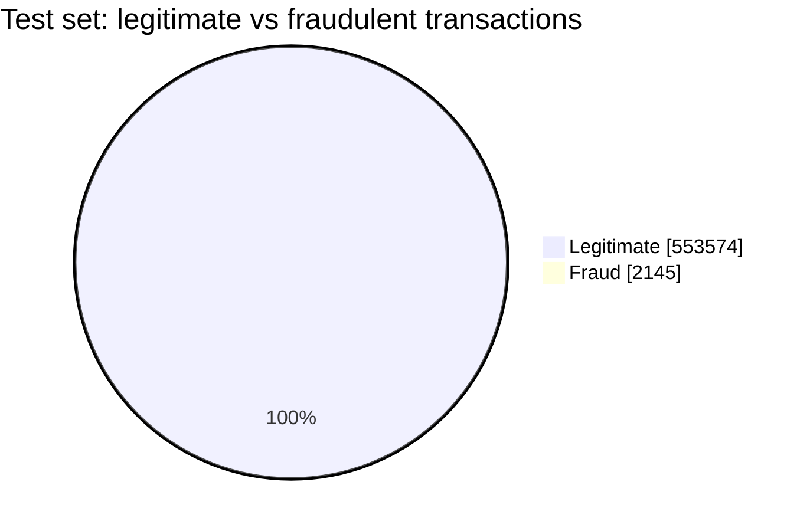
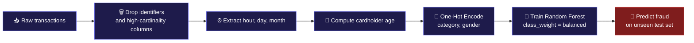
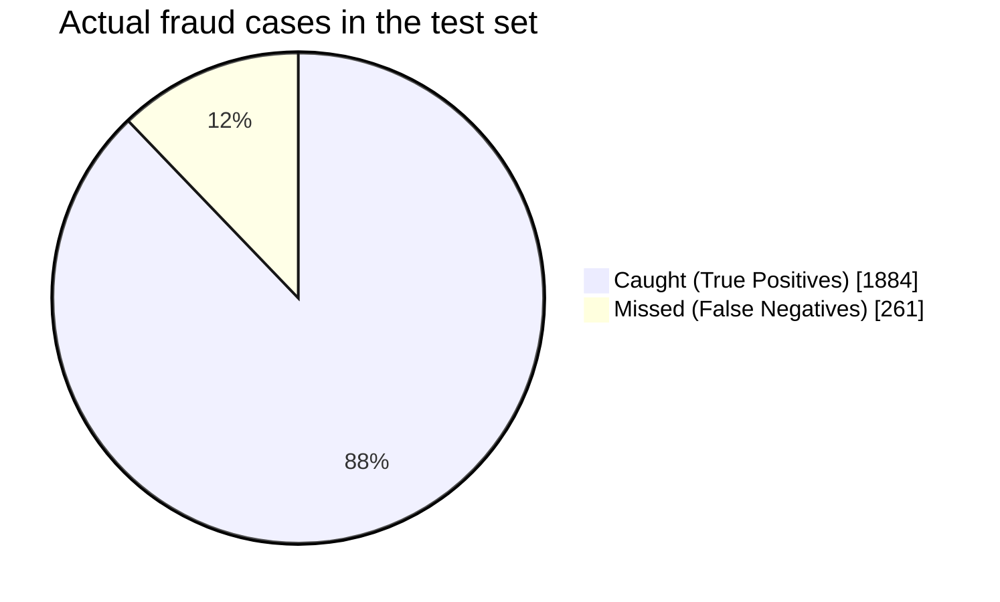
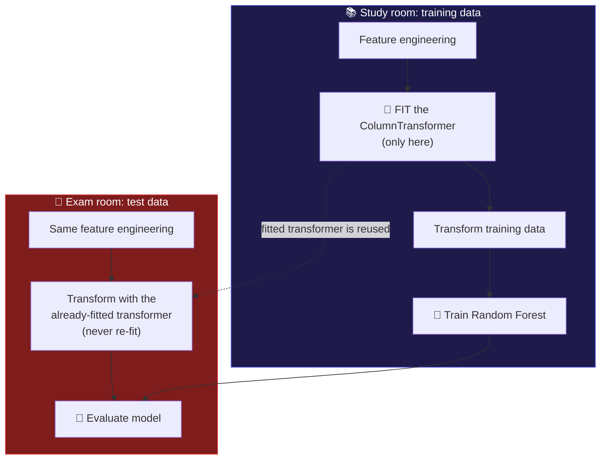

<p align="center">
  
</p>

<p align="center">
  
</p>

<p align="center">
  
  
  
</p>

<p align="center">
  
  
  
  
  
</p>

<p align="center">
  <a href="#-mission-briefing">Briefing</a> •
  <a href="#-the-haystack-problem">The Problem</a> •
  <a href="#-dataset">Dataset</a> •
  <a href="#-the-detection-pipeline">Pipeline</a> •
  <a href="#-results">Results</a> •
  <a href="#-the-airtight-exam-room-leakage-prevention">Leakage Prevention</a> •
  <a href="#-installation">Install</a>
</p>

---

## 🕵️ Mission Briefing

> [!NOTE]
> **In one sentence:** this project trains a Random Forest to scan credit card transactions and raise an alarm on the fraudulent ones, and it catches **88% of real fraud** on data it has never seen before.

**Explain it like I'm five:**
Imagine a security guard watching 555,719 shoppers walk past. Only about 2,145 of them are thieves. The guard can't just wave everyone through (that would be "99.6% correct" and totally useless), so he has to learn the *behavior* of thieves: odd hours, odd categories, odd amounts. That is what this model learned to do.

```
📥 Transactions  ➜  🧹 Clean & engineer features  ➜  🌲 Random Forest  ➜  🚨 Fraud alert / ✅ All clear
```

---

## 🌾 The Haystack Problem

Fraud is rare. In the test set, only **2,145 out of 555,719** transactions are fraudulent, roughly **1 in every 259**.

```
Legitimate  ████████████████████████████████████████████████  553,574  (99.61%)
Fraud       ▏                                                    2,145  ( 0.39%)
```



> [!WARNING]
> **Why accuracy lies here:** a lazy model that says "not fraud" every single time would score about **99.6% accuracy** while catching **zero** thieves. That is exactly why this project is judged on **Fraud Recall** and **PR-AUC**, not accuracy.

### The four villains this project had to defeat

| | Villain | Why it is dangerous |
|:-:|---|---|
| ⚖️ | **Extreme class imbalance** | Fraud is under 1% of the data, so naive models just predict "legit" for everything |
| 🔓 | **Data leakage** | Preprocessing fitted on test data quietly inflates results and fools you |
| 🔢 | **High cardinality** | Columns like `merchant`, `city`, `trans_num` explode dimensionality and cause memorization |
| 💸 | **Unequal cost of mistakes** | A missed fraud is a direct financial loss; a false alarm is just a quick review |

---

## 📂 Dataset

**Source:** [Fraud Detection Dataset on Kaggle](https://www.kaggle.com/datasets/kartik2112/fraud-detection)

The dataset's own train/test split is used as-is, which keeps the final evaluation honest.

| Dataset | Transactions |
|---|---:|
| `fraudTrain.csv` | 1,296,675 |
| `fraudTest.csv` | 555,719 |
| **Total** | **1,852,394** |

**Target variable `is_fraud`:** `0` = ✅ legitimate, `1` = 🚨 fraudulent

---

## 🛠️ The Detection Pipeline



<details>
<summary><b>🗑️ Step 1: Removing high-cardinality features (click to expand)</b></summary>

<br/>

These columns were dropped because they are identifiers or near-unique values that add dimensionality without teaching the model anything general:

```text
Unnamed: 0   trans_num   cc_num   first   last   street
unix_time    merchant    job      city    state  zip
```

Keeping raw IDs like `cc_num` or `trans_num` would let the model *memorize* specific cards and transactions instead of learning real fraud patterns.

</details>

<details>
<summary><b>⏰ Step 2: Date and time features (click to expand)</b></summary>

<br/>

`trans_date_trans_time` was parsed into a `datetime` and split into:

- `hour`
- `day`
- `month`

Fraud often hides in *when* a purchase happens (unusual hours), and a raw timestamp can't show that pattern to the model directly.

</details>

<details>
<summary><b>🎂 Step 3: Cardholder age (click to expand)</b></summary>

<br/>

`dob` was converted to a `datetime` and combined with the transaction date to get the cardholder's **approximate age at the time of purchase**. Age is far more meaningful to a model than a raw birth date.

</details>

<details>
<summary><b>🔢 Step 4: Categorical encoding (click to expand)</b></summary>

<br/>

`category` and `gender` were turned into numbers with `OneHotEncoder`:

```python
OneHotEncoder(
    sparse_output=False,
    handle_unknown='ignore'
)
```

The `ColumnTransformer` was **fitted only on the training data**, then reused to transform the test data. See [the Airtight Exam Room](#-the-airtight-exam-room-leakage-prevention) for why this matters.

</details>

---

## 🌲 The Model

```python
RandomForestClassifier(
    n_estimators=150,
    max_depth=20,
    min_samples_split=5,
    min_samples_leaf=2,
    max_features='sqrt',
    class_weight='balanced',
    random_state=42,
    n_jobs=-1
)
```

| Why Random Forest? | What it gives this problem |
|---|---|
| 🌿 Handles nonlinear patterns | Fraud rarely follows a clean straight line |
| 🧩 Mixes feature types | Numbers and one-hot categories work together |
| 🗳️ Ensemble of trees | Many trees voting beats one tree guessing |
| ⚖️ `class_weight='balanced'` | Makes missing a fraud hurt more during training |

> [!TIP]
> **The secret weapon is `class_weight='balanced'`.** Instead of resampling the data with SMOTE or undersampling, the model is simply *punished harder* for missing the rare fraud class. The full, undistorted dataset stays intact.

---

## 📊 Results

Everything below is measured on **`fraudTest.csv`**, data the model never saw during training.

### 🏆 The Scoreboard

```
Fraud Recall      ██████████████████░░  88%     caught 1,884 of 2,145 frauds
Fraud Precision   ███████████░░░░░░░░░  57%     about 6 in 10 alerts are real fraud
PR-AUC            █████████████████░░░  0.86    strong across all thresholds
Accuracy          ████████████████████  99.69%  true, but misleading on its own
```

| Metric | Score | What it means in plain words |
|---|---:|---|
| **Fraud Recall** | **88.00%** | Of all real thieves, the model caught 88% |
| **Fraud Precision** | 57.00% | Of everyone the model flagged, 57% were truly thieves |
| **PR-AUC** | 0.86 | Good precision/recall balance, even on this lopsided data |
| **Accuracy** | 99.69% | Correct overall, but remember the 99.6% lazy baseline |

### 🎯 Where did the 2,145 real frauds go?



> [!IMPORTANT]
> **Why recall is the priority:** a missed fraud is real money gone. A false alarm is usually just a quick check or a text message to the customer. So the model was tuned to cast a *wider net*. The 57% precision is a deliberate trade-off, not an oversight.

### 🧮 Confusion Matrix

<p align="center">
  
</p>

| | Result | Count | Meaning |
|:-:|---|---:|---|
| ✅ | True Positive | 1,884 | Fraud correctly caught |
| ❌ | False Negative | 261 | Fraud that slipped through |
| ✅ | True Negative | 552,137 | Legitimate, correctly cleared |
| ⚠️ | False Positive | 1,437 | Legitimate, wrongly flagged |

Put simply: to catch **1,884** thieves, the model raised **1,437** false alarms among more than half a million honest purchases.

### 📉 Precision-Recall Curve

<p align="center">
  
</p>

On data this lopsided, the ROC curve can look flattering because it is dominated by the huge pile of easy true negatives. The **Precision-Recall curve** looks only at the rare fraud class, so it is the more honest judge.

<p align="center"><b>📐 PR-AUC = 0.86</b></p>

---

## 🔒 The Airtight Exam Room (Leakage Prevention)

Think of the test set as a **final exam**. If the student sees the exam questions while studying, a perfect score means nothing. Here, the test data is locked away until the very end.



The `OneHotEncoder` / `ColumnTransformer` is **fitted exclusively on the training set** and then only *applied* to the test set. That guarantees the reported numbers reflect real generalization, not information the model quietly absorbed from the exam.

---

## 🧰 Technologies Used

| Category | Tools |
|---|---|
| Language | 🐍 Python |
| Data Handling | Pandas, NumPy |
| Machine Learning | Scikit-learn (Random Forest Classifier) |
| Visualization | Matplotlib |
| Environment | Jupyter Notebook |

---

## 📁 Project Structure

```
Credit-Card-Fraud-Detection/
│
├── images/
│   ├── Confusion M.png
│   └── Precision-Recall Curve.png
├── data/
│   ├── fraudTrain.csv
│   └── fraudTest.csv
├── notebooks/
│   └── credit_card_fraud_detection.ipynb
├── README.md
└── requirements.txt
```

---

## ⚙️ Installation

```bash
# 1. Clone the repository
git clone https://github.com/khaled-amireh/Credit-Card-Fraud-Detection.git
cd Credit-Card-Fraud-Detection

# 2. Create and activate a virtual environment (recommended)
python -m venv venv
source venv/bin/activate      # On Windows: venv\Scripts\activate

# 3. Install dependencies
pip install -r requirements.txt

# 4. Launch the notebook
jupyter notebook notebooks/credit_card_fraud_detection.ipynb
```

> [!CAUTION]
> The raw CSV files are **not included** in this repository because of their size. Download `fraudTrain.csv` and `fraudTest.csv` from the [Kaggle dataset page](https://www.kaggle.com/datasets/kartik2112/fraud-detection) and place them in the `data/` folder before running the notebook.

---

## ⚠️ Limitations

<details>
<summary><b>Click to see what this model does not do (yet)</b></summary>

<br/>

- The model has not been cross-validated across multiple folds, so the metrics reflect one fixed test split.
- Precision of 57% means a meaningful share of alerts are false alarms; in production this must be weighed against the cost of manual review.
- The classification threshold behind the headline Recall/Precision was not explicitly tuned. The Precision-Recall curve suggests more gains are possible by adjusting it to a specific business cost trade-off.

</details>

---

## 🚀 Future Improvements

- [ ] Tune the decision threshold against a real cost function (missed fraud vs. false alarm)
- [ ] Add cross-validation for more robust estimates
- [ ] Benchmark against XGBoost / LightGBM, common in production fraud systems
- [ ] Use SHAP to explain *why* each transaction was flagged
- [ ] Engineer geographic features, such as distance between cardholder and merchant

---

## 👤 Author

<p align="center">
  <b>Khaled Amireh</b><br/>
  <a href="https://github.com/khaled-amireh">🔗 GitHub</a>
</p>

<p align="center"><i>If this project helped you, drop a ⭐ on the repo.</i></p>

<p align="center">
  
</p>
